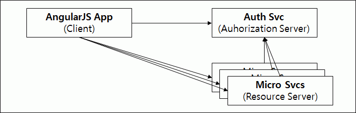
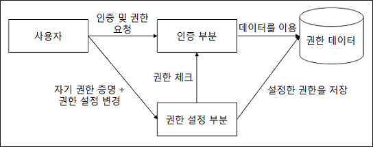
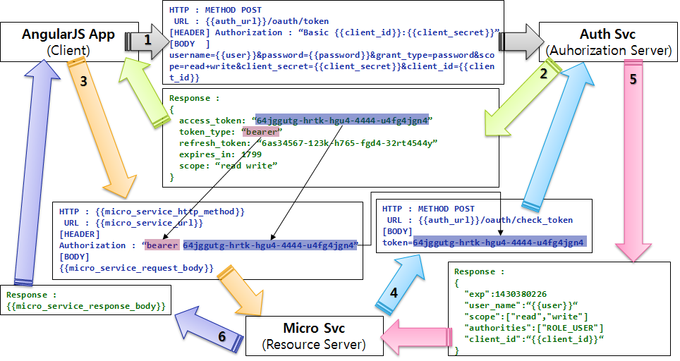
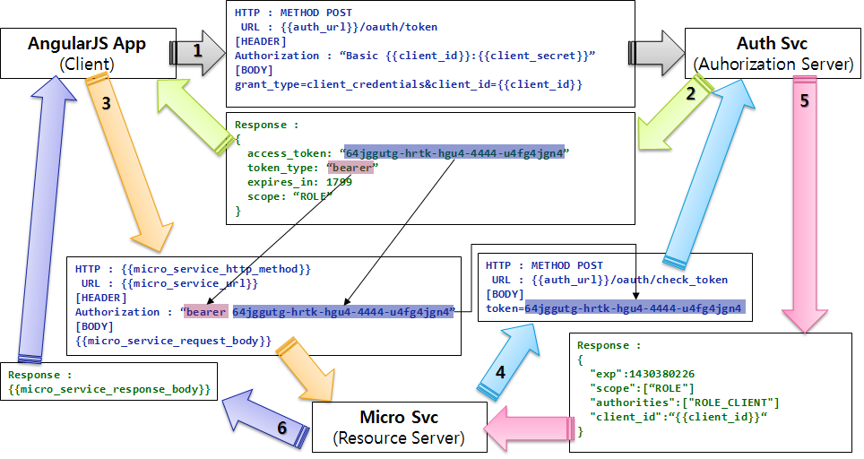
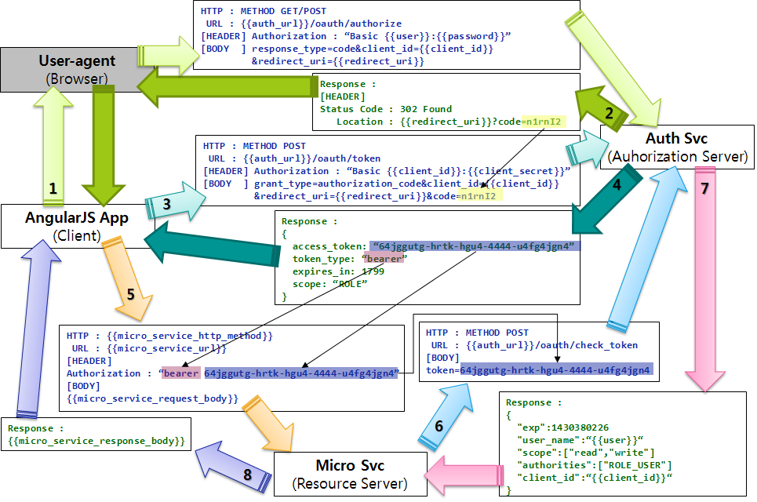
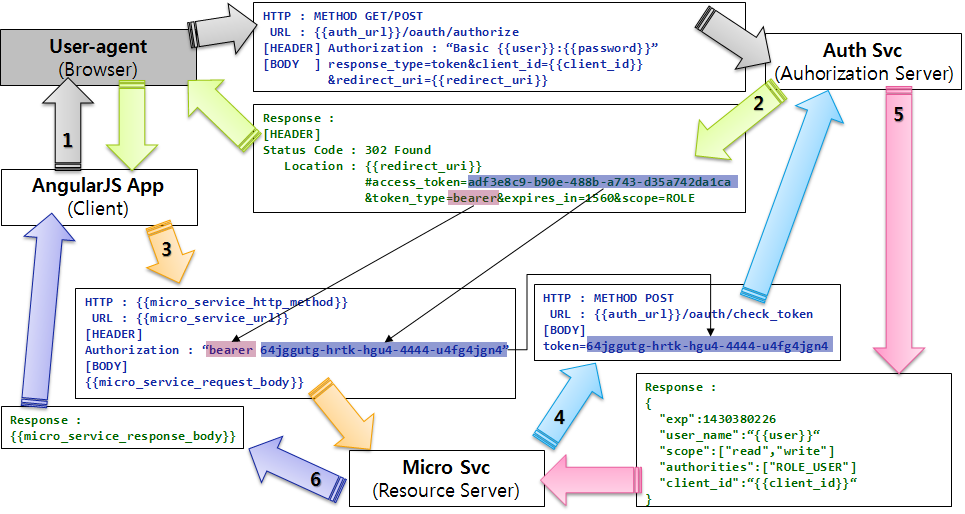
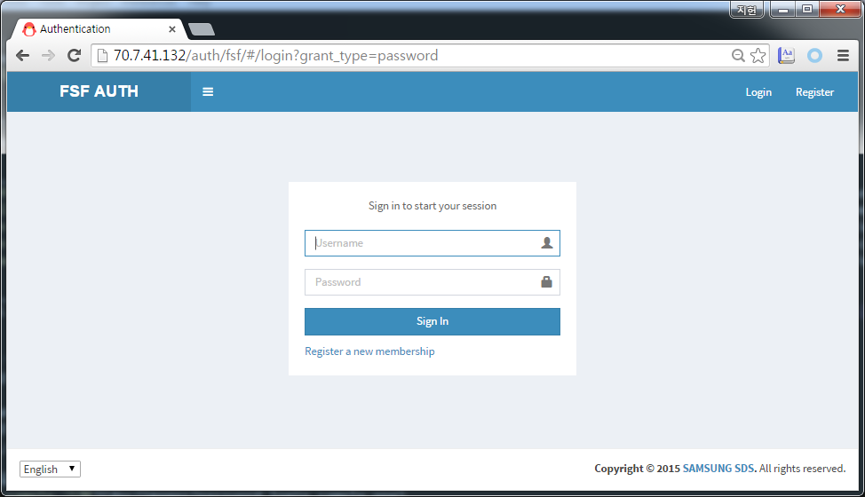
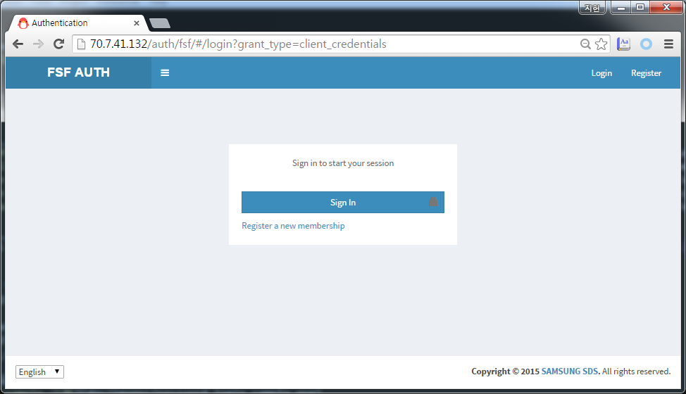
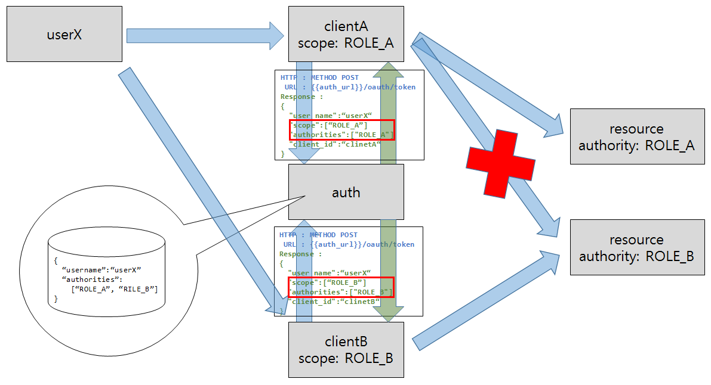
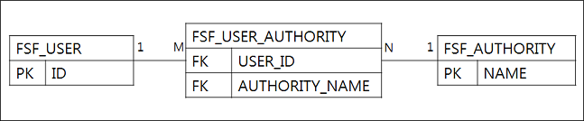

# __5s Framework Authorization Service__
---
>[Spring Security OAuth][]의 [OAuth 2.0][] 구현을 기반으로 하는 5s Framework 인증 마이크로 서비스입니다. 
>5s Framework의 [__비즈니스 마이크로 서비스__][]에 사용자 또는 client application 인증을 제공합니다.
>
>

## __목차__
---
>1. [Application](#5s1)
>   * [시작하기](#5s1-1)
>   * [구조](#5s1-2)
>2. [인증(OAuth 2.0 Specification)](#5s2)
>	* [역할자(Role)](#5s2-1)
>	* [인증 방법](#5s2-2)
>	* [인증 방법에 따른 절차](#5s2-3)
>	* [인증 방법에 따른 구현 예제](#5s2-4)	
>3. [권한 설정(Custom)](#5s3)
>	* [권한(Authority)의 정의](#5s3-1)
>	* [사용자 권한](#5s3-2)
>	* [5s framework 인증 마이크로 서비스의 추가 기능](#5s3-3)
>4. [API 목록](#5s4)
>

## <a id="5s1"/>__1. Application__
---
### <a id="5s1-1"/>__시작하기__
---
>##### __설치 및 실행__ 
>1. git clone으로 local reposiotry 생성
>2. Java IDE에서 Maven project로 import
>3. 실행
>	* 방법1. com.sds.fsf.auth.Application.main() 실행
>	* 방법2. Web Application으로 실행
><br><br>
>
>##### __DB Schema 초기 설정__ 
>* DDL, DML을 이용
>	* Table DDL[(링크)](http://70.121.244.190/gitnsam/fsframework/fsf-auth-svc/blob/master/src/main/resources/oauth2.sql)
>	* Sample Data DML[(링크)](http://70.121.244.190/gitnsam/fsframework/fsf-auth-svc/blob/master/src/main/resources/oauth2_data.sql)
>* Liquibase 이용 자동 생성
>	* 실행 (방법1)의 경우, H2 기반의 메모리 DB자동 생성
>	* Liquibase 사용 여부 설정 : DatabaseConfiguration.java[(링크)](http://70.121.244.190/gitnsam/fsframework/fsf-auth-svc/blob/master/src/main/java/com/sds/fsf/auth/config/DatabaseConfiguration.java#L77-97)
>   * Liquibase 초기 데이터 설정 resource/config/liquibase/**[(링크)](http://70.121.244.190/gitnsam/fsframework/fsf-auth-svc/tree/master/src/main/resources/config/liquibase) 
><br><br>
>
>##### __실행 환경__ 
>* (방법1)로 실행시 applicaiton-boot.xml[(링크)](http://70.121.244.190/gitnsam/fsframework/fsf-auth-svc/blob/master/src/main/resources/config/application-boot.yml)
>* (방법2)로 실행시 applicaiton-dev.xml[(링크)](http://70.121.244.190/gitnsam/fsframework/fsf-auth-svc/blob/master/src/main/resources/config/application-dev.yml)
><br><br>
>

### <a id="5s1-2"/>__구조__
---
>Application의 구조는 크게 두 부분으로 나눌 수 있다. 두 부분은 서로 각각의 기능에 의존성을 가진다.
><br><br>

>##### __인증 부분__ 
>* 사용자 인증 후, 각 사용자에 해당하는 권한을 반환한다.
>* (권한 설정 부분에서) 설정된 권한 데이터를 이용한다.
>* OAuth2 Specification 영역
><br><br>

>##### __권한 설정 부분__ 
>* 부여 권한을 관리하고, 각 사용자에 권한을 부여한다. 
>* (인증 부분으로) 인증된 사용자 중에서 권한이 있는 자만 사용할 수 있다.
>* Custom 영역
><br><br>

>

## <a id="5s2"/>__2. 인증(OAuth 2.0 Specification)__
---
>자세한 내용은 [OAuth 2.0][] 참조

### <a id="5s2-1"/>__역할자(Role)__
---
|역할자              |역할                                                                                                                                                     |
|--------------------|---------------------------------------------------------------------------------------------------------------------------------------------------------|
|Resource Owner      |사람                                                                                                                                                     |
|Client              |Resource를 이용하는 Application, Authorization Grant Type에 따라 Access_token을 발급 받아 Resource를 이용                                                |
|Resource Server     |Resource를 보관하는 Application, Access_token을 체크하기 위해 Authorization Server에 부탁, Authorized된 Client에 Resource를 내어줌                       | 
|Authorization Server|Resource에 접근을 허가하는 Application, 허가된 Authorization Grant Type을 확인하고 Access_toekn을 발급, Resource Server의 요청에 따라 Access_token을 확인|


### <a id="5s2-2"/>__인증 방법__
---
>* [Password](#password)[(외부 link)](http://tools.ietf.org/html/rfc6749#section-4.3)
>* [Client credentials](#client-credentials)
>* [Authorization code](#cuthorization-code)
>* [Implicit](#implicit)

### <a id="5s2-3"/>__인증 방법에 따른 절차__
---

#### __Password__
---
>1. AngularJS App이 Auth Svc로부터 access_token 획득을 위한 호출
>2. Auth Svc가 AngularJS App에 access_token 반환
>3. AngularJS App이 access_token과 함께 Micro Svc 호출
>4. Micro Svc는 Auth Svc에 access_token 체크
>5. Auth Svc가 Micro Svc에 token 정보 반환
>6. Micro Svc가 AngularJS App에 응답
>

#### __Client credentials__
---
>1. AngularJS App이 Auth Svc로부터 access_token 획득을 위한 호출
>2. Auth Svc가 AngularJS App에 access_token 반환
>3. AngularJS App이 access_token과 함께 Micro Svc 호출
>4. Micro Svc는 Auth Svc에 access_token 체크
>5. Auth Svc가 Micro Svc에 token 정보 반환
>6. Micro Svc가 AngularJS App에 응답
>

#### __Authorization code__
---
>1. AngularJS App에서 User-agent를 통해 Auth Svc access_token 획득을 위한 호출
>2. Auth Svc가 AngularJS App에 access_token 및 Http Status Code 302 반환, User-agent가 Location 값을 이용하여 AngularJS App 호출 및 code 전달
>3. AngularJS App이 전달받은 code값을 이용하여, Auth Svc로부터 access_token 획득을 위한 호출
>4. Auth Svc가 AngularJS App에 access_token 반환
>5. AngularJS App이 access_token과 함께 Micro Svc 호출
>6. Micro Svc는 Auth Svc에 access_token 체크
>7. Auth Svc가 Micro Svc에 token 정보 반환
>8. Micro Svc가 AngularJS App에 응답
>

#### __Implicit__
---
>1. AngularJS App에서 User-agent를 통해 Auth Svc access_token 획득을 위한 호출
>2. Auth Svc가 AngularJS App에 access_token 및 Http Status Code 302 반환, User-agent가 Location 값을 이용하여 AngularJS App 호출 및 access_token 전달
>3. AngularJS App이 access_token과 함께 Micro Svc 호출
>4. Micro Svc는 Auth Svc에 access_token 체크
>5. Auth Svc가 Micro Svc에 token 정보 반환
>6. Micro Svc가 AngularJS App에 응답
>


### <a id="5s2-4"/>__인증 방법에 따른 구현 예제__
---
>5s Framework Authorization Service는 AngularJS 기반의 인증 방법에 따른 구현 예제를 함께 포함하고 있다.
><br><br>
>
>##### __소스 코드__
>* [Login View (HTML)](http://70.121.244.190/gitnsam/fsframework/fsf-auth-svc/blob/chs_dev/src/main/webapp/app/modules/account/views/login.view.html)
>* [Login Controller (Javascript)](http://70.121.244.190/gitnsam/fsframework/fsf-auth-svc/blob/chs_dev/src/main/webapp/app/modules/account/controllers/login.controller.js)
>* [Authorization Service (Javascript)](http://70.121.244.190/gitnsam/fsframework/fsf-auth-svc/blob/chs_dev/src/main/webapp/app/common/auth/provider/auth.oauth2.service.js)
>* [Authorization Code Default Redirect URI Page (HTML)](http://70.121.244.190/gitnsam/fsframework/fsf-auth-svc/blob/chs_dev/src/main/webapp/oauth_redirect_code.html)
>* [Implicit Default Redirect URI Page (HTML)](http://70.121.244.190/gitnsam/fsframework/fsf-auth-svc/blob/chs_dev/src/main/webapp/oauth_redirect_token.html)
><br><br>
>
>##### __접속 주소__
>
>__{ AUTH_SVC_URL } /auth/fsf/#/login?grant_type= \[ *password* | *client_credentials* | *authorization_code* | *implicit* \] ( &redirect_uri= { REDIRECT_URI } )__
>
>```
>	{ AUTH_SVC_URL } :
>		5s Framework Authorization Service의 URL 주소
>
>	grant_type=[password|client_credentials|authorization_code|implicit] :
>		인증 방법의 종류로 password, client_credentials, authorization_code, implicit 중 택 1.
>
>	(&redirect_uri={ REDIRECT_URI }) :
>		authorization_code, implicit 인증 방법은 인증 후 token 발급을 위한 redirect_uri를 설정해주어야 한다. 생략가능
>
>	cf. password 인증 방법으로 인증하고자 할 때,
>		http://123.123.123.123/auth/fsf/#/login?grant_type=password
>
>	cf. authorization_code 인증 방법으로 인증하고자 할 때, redirect_uri를 지정하지 않을 경우 default 값이 호출  
>		http://123.123.123.123/auth/fsf/#/login?grant_type=password&redirect_url=http://111.111.111.111/redirected  
>```
><br>
>
>접속하면 다음과 같은 화면을 볼 수 있다.
><br><br>
>
>__password 인증방법 login 화면__ 
>
><br><br>
>
>__client_credentials 인증방법 login 화면__ 
>

## <a id="5s3"/>__3. 권한 설정(Custom)__
---
>위에서 설명한 Spring Security OAuth와 OAuth 2.0은 인증(Authorization)에 대한 Specification이며, 
>별도로 인증할 권한(Authority)에 대해 정의하고, 설정하는 내용이 필요합니다. 
>아래 설명하는 내용은 다음과 같은 내용을 포함합니다.
>
>* 권한(Authority)의 정의
>* 사용자 권한
>* 5s Framework 인증 마이크로 서비스의 추가 기능

### <a id="5s3-1"/>__권한(Authority)의 정의__
---
>
>##### __권한의 부여__
>권한은 Client Appication 또는 사용자에 부여
><br><br>

>
>##### __권한의 형식__ 
>정규표현식 `"^ROLE(_[A-Z][A-Z0-9]*)+$"`을 만족하는 String 
>```
>	//Java 표현식으로 권한 myAuthority는 
>	myAuthority instanceof String == true
>	myAuthority.matches("^ROLE(_[A-Z][A-Z0-9]*)+$") == true
>```
>하위 권한은 정규표현식 `"^(상위권한)(_[A-Z][A-Z0-9]*)+$"`을 만족
>```
>	//Java 표현식으로 권한 authorit의 하위 권한 subAuthority 
>	subAuthoruty.matches("^" + authority + "(_[A-Z][A-Z0-9]*)+$") == true
>```
>
><br>

>
>##### __권한의 계층__
>상위 권한은 하위 권한을 생성, 삭제, 부여
>상위 권한은 하위 권한을 포함
><br><br>

>
>##### __권한의 범위(scope)__ 
>```
>	client 범위(scope) 안에서의 user 권한만 유효하다.
>
>	cf. client가 범위 “ROLE_A”, “ROLE_B_BB”. “ROLE_C”, “ROLE_E”를 가지고,
>	      user가 권한 “ROLE_A_AA”, “ROLE_B”, “ROLE_C”, “ROLE_D”을 가지면, 
>	      user는 권한 “ROLE_A_AA”, “ROLE_C” 만 사용 가능하다.
>
>	cf. client의 권한과 범위는 다른 개념이다.
>```
>
>

### <a id="5s3-2"/>__사용자 권한__
---
>권한의 설정은 데이터베이스의 테이블 데이터로 설정된다. 테이블의 구성은 다음과 같다.
>* 부여할 권한을 구분한 데이터인 `FSF_AUTHORITY` 테이블
>* 권한 부여의 대상이 되는 사용자 데이터인 `FSF_USER` 테이블
>* 사용자 별로 부여된 권한을 저장한 데이터인 `FSF_USER_AUTHORITY` 테이블
>
>
><br><br>

### <a id="5s3-3"/>__5s framework 인증 마이크로 서비스의 추가 기능__

|구분|내역|
|----|----|
|권한 관리자 기능|<ul><li>권한 생성</li><li>권한 부여</li><li>내 권한 조회</li><li>부여 가능 권한 조회</li><li>부여 가능 권한 彼부여자 조회</li><li>사용자 권한 조회</li></ul>|
|인증 사용자 기능|<ul><li>사용자 등록</li><li>사용자 등록 시, 가능 입력값 여부 확인</li><li>비밀번호 변경</li><li>사용자 찾기</li><li>비밀번호 찾기</li><li>사용자 이벤트 기록</li><li>로그인 실패 횟수 제한</li><li>비밀번호 유효기간</li></ul>|

#### __권한 관리자 기능__
-------------------------
>
>##### __권한 생성__
>관리자가 가진 권한의 하위 권한으로 부여 가능한 권한을 생성한다.
>
>##### __권한 부여__
>관리자가 가진 권한의 하위 권한으로 부여 가능한 권한을 사용자에 부여한다.
>
>##### __내 권한 조회__
>관리자의 권한을 조회한다.
>
>##### __부여 가능 권한 조회__
>관리자가 부여할 수 있는 권한을 조회한다.
>
>##### __부여 가능 권한 彼부여자 조회__
>관리자의 부여할 수 있는 권한을 부여 받은 사용자를 조회한다.
>
>##### __사용자 권한 조회__
>사용자에게 부여된 권한 중, 관리자가 부여 가능한 권한을 조회한다.
>

####  __인증 사용자 기능__
-------------------------
>
>##### __사용자 등록__
>사용자를 추가한다.
>
>##### __사용자 등록 시, 가능 입력값 여부 확인__
>사용자 계정명, 이메일의 사용 가능 여부를 확인한다.
>
>##### __비밀번호 변경__
>사용자의 비밀번호를 변경한다.
>
>##### __사용자 찾기__
>등록된 사용자 이메일을 매개로 사용자 계정명을 찾는다.
>
>##### __비밀번호 찾기__
>등록된 사용자 계정명과 이메일을 매개로 사용자 비밀번호를 찾는다.
>
>##### __사용자 이벤트 기록__
>사용자의 행위에 대한 이벤트를 기록한다.
>
>##### __로그인 실패 횟수 제한__
>사용자 로그인 실패 횟수에 대한 제한을 둔다. 실패 횟수가 일정 횟수를 초과할 경우, 로그인 기능 잠금(lock)을 한다.([소스 링크](http://70.121.244.190/gitnsam/fsframework/fsf-auth-svc/blob/master/src/main/java/com/sds/fsf/auth/security/UserDetailsService.java#L49-52))
>
>##### __비밀번호 유효기간__
>비밀번호 유효기간을 설정하고 유효기간이 지날 경우, 계정 정보에 표시 되도록 한다. 

## <a id="5s4"/>__4. API 목록__
---
|URL                            |HTTP Method |기능                                                      |
|-------------------------------|------------|----------------------------------------------------------|
|oauth/check_token              |POST        |access_token 확인                                         |
|oauth/token                    |POST        |access_token 발급                                         |
|api/t2/account/                |GET         |현재 계정 정보 조회                                       |
|api/t2/account/                |POST        |현재 계정 정보 변경                                       |
|api/t2/account/change_password |POST        |현재 계정 비밀번호 변경                                   |
|api/t2/activate                |GET         |activation_key로 계정 활성화                              |
|api/t2/authenticate            |GET         |현재 계정 사용자명 조회                                   |
|api/t2/deactivate              |GET         |현재 계정 비활성화                                        |
|api/t2/register                |POST        |계정 생성                                                 |
|api/t2/register/validate       |GET         |계정 생성 시 사용 가능한 입력인지 확인                    |
|api/get_login                  |POST        |계정의 email로 계정 사용자명 조회                         |
|api/randomize_password         |POST        |계정의 사용자명과 email로 난수로 초기화된 비밀번호를 조회 |

####  __Swagger api-docs 사용하기__
-------------------------
>Spring Profile에 "API"를 추가한다.[(링크)](http://70.121.244.190/gitnsam/fsframework/fsf-auth-svc/blob/master/src/main/java/com/sds/fsf/auth/ApplicationWebXml.java#L15-20)
>```
>   //기본
>    @Override
>    protected SpringApplicationBuilder configure(SpringApplicationBuilder application) {
>        return application.profiles(addDefaultProfile())
>                .showBanner(false)
>                .sources(Application.class);
>    }
>   //변경 후
>    @Override
>    protected SpringApplicationBuilder configure(SpringApplicationBuilder application) {
>        return application.profiles(addDefaultProfile(), "API")
>                .showBanner(false)
>                .sources(Application.class);
>    }
>```


[Spring Security OAuth]: http://projects.spring.io/spring-security-oauth/
[OAuth 2.0]: http://oauth.net/2/
[__비즈니스 마이크로 서비스__]: http://70.121.244.190/gitnsam/fsframework/fsf-sample-svc/tree/master
